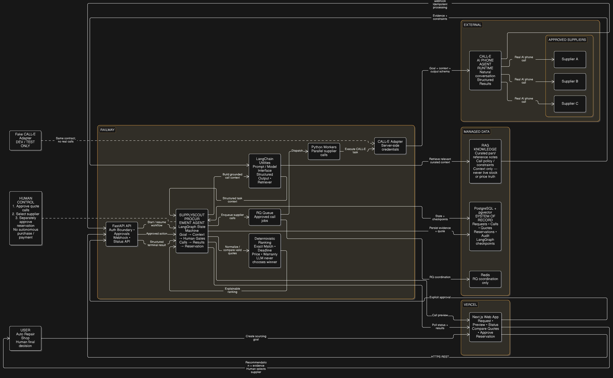
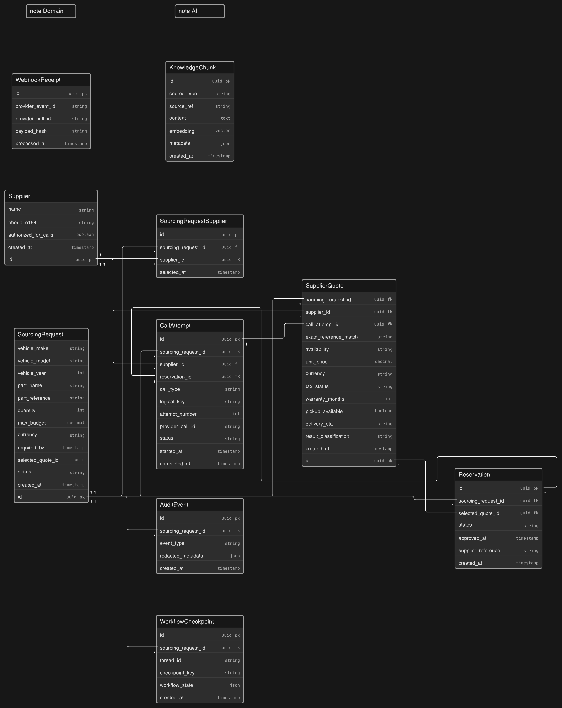

# SupplyScout Voice

SupplyScout Voice is a standalone CALL-E hackathon web application for sourcing urgent automotive parts from approved suppliers.

## System Architecture

- Next.js on Vercel provides the user and human-control interface.
- FastAPI is the server-side application boundary, with the SupplyScout Procurement Agent orchestrated by LangGraph inside the backend.
- LangChain supports model interaction, structured outputs, context construction, and retrieval without owning business state.
- PostgreSQL with pgvector stores authoritative application data and a limited curated RAG context; Redis and RQ workers coordinate asynchronous supplier calls.
- CALL-E remains the essential AI phone-call runtime for human-approved supplier calls and structured webhook results.
- Deterministic Python logic compares quotes using the allowed factors; the user approves quote calls, chooses the supplier, and separately approves reservation.

## Agent Workflow

- A sourcing request enters the SupplyScout Procurement Agent, where LangGraph manages workflow state and human approval gates while RAG contributes curated context only.
- After approval, Redis and RQ dispatch supplier calls asynchronously, and CALL-E conducts the real phone conversations.
- Structured results return through the backend for normalization and deterministic quote ranking.
- The user manually selects the supplier, then separately approves the reservation call and receives its structured outcome.

## Data Model

- The core procurement model covers suppliers, sourcing requests, selected suppliers, call attempts, supplier quotes, and reservations.
- Audit events and webhook deduplication preserve the approved workflow and safe terminal-result processing.
- LangGraph workflow checkpoints support resumable orchestration, while pgvector-backed knowledge chunks hold the limited curated RAG context.
