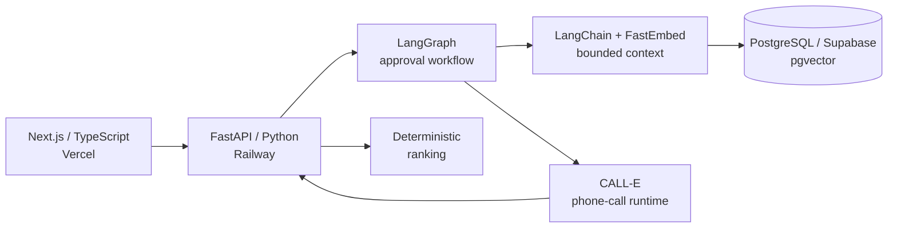

# SupplyScout Voice

> The procurement agent for businesses whose supplier data still lives on the phone.

SupplyScout Voice helps small businesses source urgent inventory and parts without manually calling every supplier. The demo vertical follows an independent auto repair shop sourcing an urgent alternator for a 2019 Renault Clio.

## Live demo

- Frontend: [supplyscout-voice.vercel.app](https://supplyscout-voice.vercel.app)
- Backend health: [supplyscout-voice-production.up.railway.app/health](https://supplyscout-voice-production.up.railway.app/health)

## Workflow

1. Create a sourcing request.
2. Retrieve bounded procurement context.
3. Preview the call plan and explicitly approve supplier calls.
4. CALL-E makes outbound calls to approved suppliers.
5. Poll CALL-E and normalize structured results while preserving unknown facts.
6. Rank quotes with deterministic business rules.
7. Let the human choose a supplier.
8. Require separate approval before a reservation call.

SupplyScout never makes a payment or autonomous purchase.

## Where CALL-E fits

CALL-E performs the actual outbound supplier phone calls. SupplyScout provides CALL-E with the structured task, recipient, result schema, and idempotency key. The backend then polls CALL-E and normalizes its structured results for comparison and selection.

## Architecture



- **Frontend:** Next.js and TypeScript, deployed on Vercel
- **Backend:** FastAPI and Python, deployed on Railway
- **Data:** PostgreSQL on Supabase with pgvector
- **Orchestration:** LangGraph
- **Retrieval and composition:** LangChain with bounded context
- **Embeddings:** FastEmbed using `BAAI/bge-small-en-v1.5`
- **Voice runtime:** CALL-E

## Safety

- Explicit human approval before outbound calls
- Strict recipient allowlist and E.164 validation
- Separate approval before reservation calls
- Idempotency protection for call dispatch
- No payments or autonomous purchases
- Unknown and uncertain supplier facts remain unknown
- Credentials remain server-side
- Fake provider mode for demos and tests

## Controlled live proof

A controlled production call to the official CALL-E US hackathon test hotline reached terminal status `completed`. CALL-E returned a real provider call ID, and SupplyScout normalized the result while correctly preserving unavailable supplier facts as unknown. No private phone number or provider call ID is included in this repository.

## Demo flow for judges

1. Open the frontend and create the Renault Clio alternator request.
2. Review the bounded context and supplier-call preview.
3. Approve the supplier calls at the explicit human gate.
4. Review normalized quotes and the deterministic ranking.
5. Select a supplier and inspect the separate reservation approval gate.

Use fake mode for a repeatable demo without placing real calls.

## Local setup

Prerequisites: Python 3.11+, Node.js 20+, and PostgreSQL when using database-backed retrieval.

### Backend

```bash
python -m venv backend/.venv
backend/.venv/Scripts/python -m pip install -r backend/requirements.txt
```

Create `backend/.env` with placeholder or local-only values:

```dotenv
APP_ENV=development
CORS_ALLOWED_ORIGINS=http://localhost:3000
DATABASE_URL=postgresql+psycopg://<user>:<password>@<host>:<port>/<database>
RAG_MODE=disabled
RAG_EMBEDDING_PROVIDER=fastembed
RAG_EMBEDDING_MODEL=BAAI/bge-small-en-v1.5
RAG_EMBEDDING_CACHE_DIR=<local-cache-directory>
CALL_PROVIDER_MODE=fake
CALLE_API_KEY=<server-side-api-key>
CALLE_BASE_URL=https://api.heycall-e.com
CALLE_LIVE_ENABLED=false
CALLE_ALLOWED_RECIPIENTS=<comma-separated-e164-allowlist>
CALLE_RECIPIENT_REGION=<supported-region>
CALLE_RECIPIENT_LOCALE=<supported-locale>
```

Start the API from the repository root:

```bash
backend/.venv/Scripts/python -m uvicorn backend.app.main:app --reload
```

For macOS or Linux, use `backend/.venv/bin/python` instead.

### Frontend

```bash
cd frontend
npm install
```

Create `frontend/.env.local`:

```dotenv
NEXT_PUBLIC_API_URL=http://localhost:8000
```

Then start the app:

```bash
npm run dev
```

Open [http://localhost:3000](http://localhost:3000).

## Verification

```bash
backend/.venv/Scripts/python -m pytest backend/tests
cd frontend
npm test
npm run lint
npm run typecheck
npm run build
```
